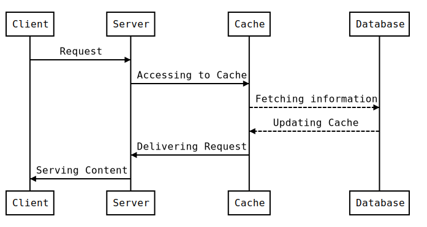

# Panne TBM

Panne-TBM est une application web Node.js permettant de traquer le nombre de panne du service de Tram TBM (Bordeaux)

L'application est trouvable ici: [panne-tbm.info](http://panne-tbm.info/)

(Le site n'était pas dispo depuis les incendies d'OVH, le compte du nombre de panne n'est pas très à jour)

## Avertissement

Cette application n'est pas à but sérieuse! Il s'agit juste d'une petite blague de l'auteur pour aborder les problèmes fréquents du réseau de tram TBM.

## Presse

> [Sudouest: Bordeaux - Il recense les problèmes de tram dans la metropole sur une page web](https://www.sudouest.fr/gironde/pessac/bordeaux-il-recense-les-problemes-de-tram-dans-la-metropole-sur-une-page-web-1350972.php)

## À FAIRE

* Traquer chaque Tram individuellement
* Page statistique
* Améliorer le design du site
* Disposer d'une API public (GraphQL ?)

## Installation

### Logiciel nécessaire

> [Node.js](https://nodejs.org/)
> [Redis](https://redis.io/)

### Commandes

Pour démarrer la base de donnée Redis en local

```bash
cd redis-stable/src/
./redis-server
```

Pour lancer l'application en local

```bash
git clone https://github.com/thclmnt/panne-tbm.git
cd panne-tbm
npm install
npm start
```

## Fonctionnement



## License

[MIT](LICENSE)
